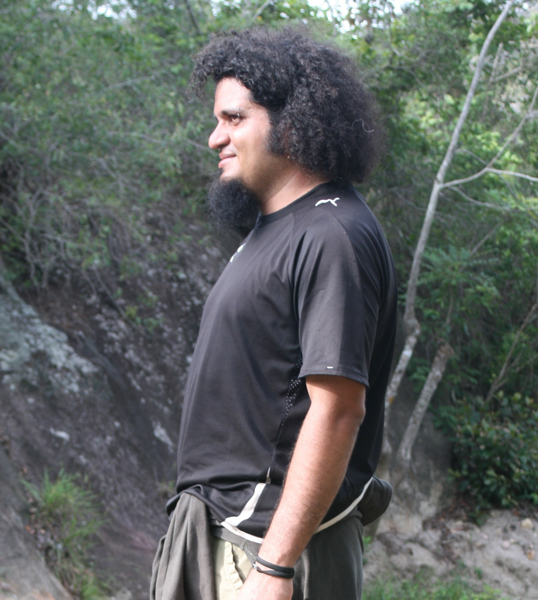

---
---

<link rel="stylesheet" href="styles.css" type="text/css">

Disfruto el trabajo interdiciplinar que involucra la biología, la ingeniería, programación y demás ciencias. 

Soy Ingeniero Ambiental por la Universidad Católica de Honduras graduado en 2004. En 2009 conlcuí estudios de maestría en Tecnologías de Información Geográfica por la Universidad de Alcalá, Madrid, España. En 2015 comence estudios de doctoriado en Ecología en la Universidad Polítécnica de Madrid, donde investigo sobre la estimación de la biodiversidad utilizando información de sensores remotos, buscando el desarrollo de un índice de complejidad de bosques. Espero terminar mis estudios a finales de 2019.

Trabajo en el Museo de Historia Natural desde el año 2011, donde comparto labores con los profesores Julio Mérida, Anthonie Andino y Gustavo Cruz. 

Mi hoja de vida visual esta disponible [aquí](pdf/CV.pdf).